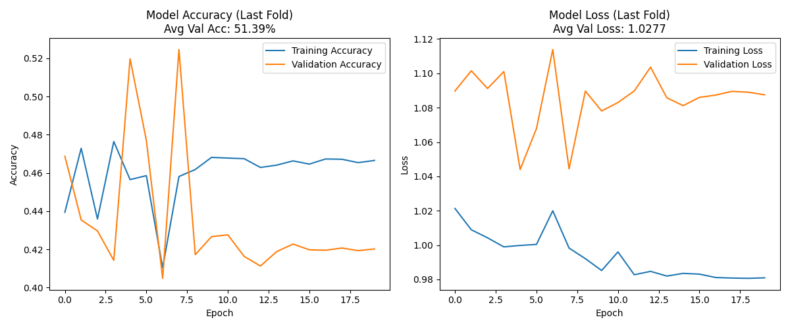

# Binance3

GRU + Attention workflow for BTC/USDT data preparation, training, brute-force search, and scheduled inference.

## Model Performance Snapshot

Best run from local brute-force training (`2025-08-13`):

- `avg_val_loss`: `1.0277`
- run folder: `brute_force_results_hl_barrier/lr0.0005-hd32-layers2-drop0.5-wd0.01-bs32-ts36-cv3-ep100`
- key params: `lr=0.0005, hidden_dim=32, layers=2, dropout=0.5, batch_size=32, time_steps=36`



## Project Files

- `data_pre.py`: Fetches OHLCV data, builds indicators, and generates triple-barrier labels.
- `GRU_attention_modified.py`: Model definition and training routine.
- `brute_force_tester.py`: Hyperparameter search runner.
- `predict.py`: Loads model bundle, runs inference, supports scheduled execution.
- `notification.py`: Sends Telegram notifications via environment variables.
- `run_predict.sh`: Convenience launcher that loads `.env.local` automatically.

## 1) Environment Setup

```bash
cd /home/nas2/Personal/Hank/Binance3-public
python3 -m venv .venv
source .venv/bin/activate
pip install --upgrade pip
pip install torch ccxt pandas pandas_ta numpy scikit-learn matplotlib pytz requests
```

## 2) Secrets Setup (`.env.local`)

1. Copy template:

```bash
cp .env.example .env.local
```

2. Edit `.env.local` and set real values:

```env
TELEGRAM_API_TOKEN=your_real_token
TELEGRAM_CHAT_ID=your_real_chat_id
```

3. Restrict local file permissions:

```bash
chmod 600 .env.local
```

`notification.py` reads `TELEGRAM_API_TOKEN` and `TELEGRAM_CHAT_ID` from environment only.

## 3) Data Preparation

```bash
source .venv/bin/activate
python3 data_pre.py --symbol BTC/USDT --timeframe 4h --days 5000 --profit-take 0.04 --stop-loss 0.02 --time-barrier 12 --output btc_labeled_data.csv
```

## 4) Brute-Force Training

```bash
source .venv/bin/activate
python3 brute_force_tester.py
```

Outputs are written under `brute_force_results_hl_barrier/` (ignored by Git by default).

## 5) Prediction

### Run once

```bash
./run_predict.sh --run-once --model-dir brute_force_results_hl_barrier/<your_best_run>
```

### Run scheduler (default behavior)

```bash
./run_predict.sh --model-dir brute_force_results_hl_barrier/<your_best_run>
```

Useful flags:

- `--no-telegram`: disable Telegram notifications.
- `--offset-minutes 5`: run N minutes after candle close.

## 6) Git Workflow (Public Repo)

```bash
git status
git add .
git commit -m "Clean public repo and add GRU training snapshot"
git push origin main
```

## 7) Security Notes

- Keep real credentials only in `.env.local`.
- If any token was leaked before, rotate/revoke it immediately.
- This public repo excludes local results, model binaries, and raw dataset artifacts by `.gitignore`.
